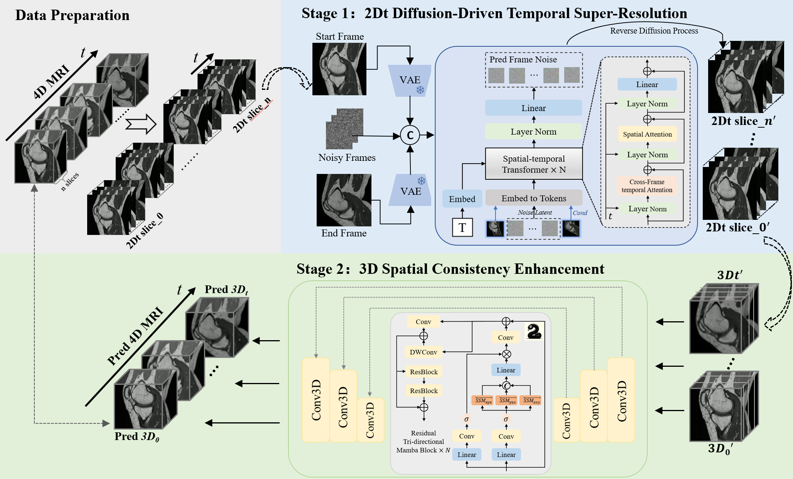

# A Diffusion-Driven Temporal Super-Resolution and Spatial Consistency Enhancement Framework for 4D MRI imaging

## Abstract
In medical imaging, 4D MRI enables dynamic 3D visualization, yet the trade-off between spatial and temporal resolution requires prolonged scan time that can compromise temporal fidelity—especially during rapid, large-amplitude motion. Traditional approaches typically rely on registration-based interpolation to generate intermediate frames; however, these methods struggle with large deformations, resulting in misregistration, artifacts, and diminished spatial consistency. To address these challenges, we propose TSSC-Net, a novel framework that generates intermediate frames while preserving spatial consistency. To solve temporal fidelity under fast motion, our diffusion-based temporal super-resolution network generates intermediate frames using the start and end frames as key references, achieving 6× temporal super-resolution in a single inference step. Additionally, we introduce a novel tri-directional mamba-based module that leverages long-range contextual information to effectively resolve spatial inconsistencies arising from cross-slice misalignment, thereby enhancing volumetric coherence and correcting cross-slice errors. Extensive experiments were performed on the public ACDC cardiac MRI dataset and a real-world dynamic 4D knee joint dataset. The results demonstrate that TSSC-Net can generate high-resolution dynamic MRI from fast-motion data while preserving structural fidelity and spatial consistency.

## Overview
In this work, we present TSSC-Net, a novel framework that overcomes key challenges in 4D MRI by bridging temporal gaps and enhancing spatial consistency. The main contributions of our work are as follows:
- We propose a diffusion-driven temporal super-resolution network with crossframe attention to generate continuous and coherent intermediate frames, addressing sparse sampling and ensuring smooth temporal interpolation in dynamic MRI.
- We design a spatial consistency enhancement network using residual tri-directional mamba blocks for multi-directional scanning, capturing long-range spatial correlations and correcting cross-slice inconsistencies.
- Our method delivers outstanding performance: achieving competitive results on ACDC cardiac MRI with minor deformations and significantly improving knee joint MRI with large motions. Notably, TSSC-Net can produce 6× temporal super-resolution in a single inference step.
  

